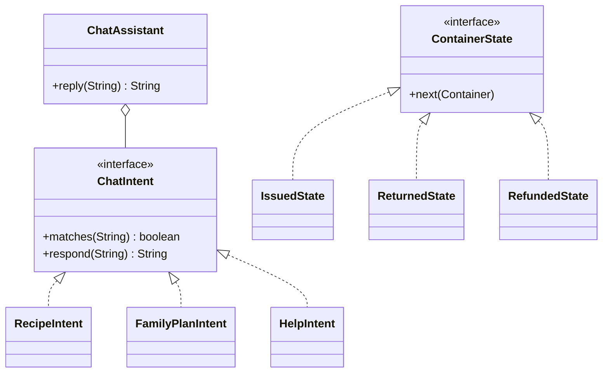

# Smart-Store
OOP lab project: a smart super-shop application built with Java
<div align="center">


<br/>


**Type a dish or a family size. Get a ready shopping list with prices.**

</div>

---

## 📑 Table of Contents

- [About the Project](#-about-the-project)
- [Objectives](#-objectives)
- [Key Features](#-key-features)
- [How the Mini AI Works](#-how-the-mini-ai-works)
- [Sample Chat](#-sample-chat)
- [OOP Concepts Used](#-oop-concepts-used)
- [Tech Stack](#-tech-stack)
- [Project Structure](#-project-structure)
- [Getting Started](#-getting-started)
- [Team](#-team)
- [Roadmap](#-roadmap)
- [Contributing](#-contributing)

---

## 📖 About the Project

**Smart Store** is a Java super-shop application that helps a customer shop faster and smarter. Instead of searching for items one by one, the customer writes a message like *"chicken roast 4 jon"* or *"poribar 5 jon, budget 15000"* and the app builds the shopping list, calculates the cost, and suggests substitutes when an item is out of stock.

The "AI" in this project is a **rule-based expert system**. It uses stored recipes, stock data, and clear rules to make decisions. It is not machine learning and it needs no internet connection.

This project is developed as a course project (Object-Oriented Programming Lab) at **Daffodil International University (DIU)**.

---

## 🎯 Objectives

> ✏️ **TODO:** Paste the objective bullet points you submitted in the project form here, so the README and your submission stay consistent.

-
-
-

---

## ✨ Key Features

| # | Feature | What it does | OOP idea | Status |
|---|---|---|---|---|
| 1 | 🍗 **Recipe-to-Grocery Bundler** | Dish name + number of people gives the full ingredient list, quantities and cost | Polymorphism, Abstraction | ✅ Core ready |
| 2 | 👨‍👩‍👧 **Family Monthly Budget Planner** | Family size + budget gives a monthly grocery list that fits the budget (greedy by priority) | Encapsulation | ✅ Core ready |
| 3 | 🔁 **Smart Substitution** | If an item is out of stock, suggests a similar item (same category, close price, in stock) | Interface, Open/Closed | ✅ Core ready |
| 4 | ⏳ **Dynamic Expiry Pricing** | Discounts increase as the expiry date gets closer (tier-based) | Interface, Polymorphism | 🚧 Planned |
| 5 | ♻️ **Eco Container Return & Cashback** | Container goes through states (issued, returned, refunded) and cashback goes to a wallet | State Pattern | 🚧 Planned |
| 6 | 🔒 **Cart Stock Lock (3 min)** | Reserves stock for a short time so two users cannot buy the last item | Multithreading | 🚧 Planned |

> Features are planned and may change as development continues.

---

## 🧠 How the Mini AI Works


1. The **ChatAssistant** sends the message to the first **ChatIntent** that matches it.
2. **RecipeAssistant** multiplies per-person quantities by the number of people and checks stock.
3. **BudgetPlanner** sorts items by priority and adds them one by one while the budget lasts (greedy method).
4. **SubstitutionEngine** finds an alternative when stock is low or the budget is tight.

To add a new chat feature, write one new class that implements `ChatIntent`. Existing code does not change (Open/Closed Principle).

---

## 💬 Sample Chat

```text
YOU: chicken roast 4 jon
BOT: chicken roast (4 jon):
- chicken: 1 kg = 210 Tk
- onion: 200 g = 12 Tk
- garlic: 40 g = 9 Tk
- yogurt: 120 g = 22 Tk
- soybean oil: 60 ml = 11 Tk
- salt: 12 g = <1 Tk
Mot khoroch: 264 Tk
```

```text
YOU: dawat e chicken roast 60 jon
BOT: chicken roast (60 jon):
- sonali chicken: 15 kg = 3600 Tk  (chicken stock e kom, tai sonali chicken)
...
```

> Prices and quantities are sample data and can be changed in the data files.

---

## 🧩 OOP Concepts Used

| Concept | Where |
|---|---|
| **Encapsulation** | `private` fields with getters/setters in `Product`, `Inventory` |
| **Inheritance** | `User` to `Admin` / `Customer`, `Product` to perishable / non-perishable |
| **Polymorphism** | `ChatIntent.respond()`, `PricingRule.apply()`, `Payment.pay()` |
| **Abstraction** | abstract classes and interfaces (`ChatIntent`, `PricingRule`, `ContainerState`) |
| **Design Patterns** | State Pattern (eco container), Strategy-style rules (pricing, substitution) |



---

## 🛠️ Tech Stack

| Layer | Technology |
|---|---|
| Language | Java 17+ |
| UI | Java Swing |
| Data storage | Text / CSV files |
| Concurrency | `java.util.concurrent` (scheduler, locks) |
| Diagrams | draw.io (UML), Mermaid |
| Version Control | Git & GitHub |

---

## 📁 Project Structure

```text
Smart-Store/
├── assets/            # banner and images
├── data/              # products, recipes, monthly items
├── docs/              # UML diagrams, report, screenshots
├── src/
│   └── smartstore/
│       ├── ai/        # recipe assistant, budget planner, chat
│       ├── pricing/   # dynamic expiry pricing rules
│       ├── eco/       # container return (State Pattern) and wallet
│       ├── lock/      # cart stock lock (multithreading)
│       └── ui/        # Swing screens
└── README.md
```

---

## 🚀 Getting Started

### Prerequisites

- Java JDK 17 or later
- Git

### Installation

```bash
# 1. Clone the repository
git clone https://github.com/jobayerhassan/Smart-Store.git

# 2. Move into the project folder
cd Smart-Store

# 3. Compile and run the console demo of the mini AI
javac -d out src/smartstore/ai/*.java
java -cp out smartstore.ai.Main
```

---

## 👥 Team

**Section:** ___ | **Institution:** Daffodil International University | **Course:** Object-Oriented Programming Lab

| Member | Student ID | Name | GitHub | Focus |
|---|---|---|---|---|
| Member 1 | 252-15-398 | Jobayer Hossen | [@jobayerhassan](https://github.com/jobayerhassan) | Recipe assistant and chat |
| Member 2 | 252-15-___ | _name_ | [@ishtiakinan8-creator](https://github.com/ishtiakinan8-creator) | Budget planner |
| Member 3 | 252-15-___ | _name_ | [@tafhim696](https://github.com/tafhim696) | Expiry pricing and substitution |
| Member 4 | 252-15-___ | _name_ | [@username](https://github.com/username) | Eco container return |
| Member 5 | 252-15-___ | _name_ | [@username](https://github.com/username) | Cart stock lock |

---

## 🗺️ Roadmap

- [x] Project proposal and team formation
- [x] GitHub repository setup
- [x] Core mini AI (recipe assistant, budget planner, substitution)
- [ ] Design data models and UML diagram
- [ ] Dynamic expiry pricing
- [ ] Eco container return with State Pattern
- [ ] Cart stock lock with multithreading
- [ ] Build Swing screens (login, shop, chat, cart, admin)
- [ ] Testing and bug fixing
- [ ] Report and final presentation

---

## 🤝 Contributing

1. Pull the latest code: `git pull`
2. Create a new branch for your work: `git checkout -b feature/your-feature`
3. Commit with a clear message: `git commit -m "Add ExpiryRule class"`
4. Push the branch: `git push origin feature/your-feature`
5. Open a Pull Request and ask a teammate to review it

Each member works in their own package so files do not clash. Shared files such as `Main.java` are edited by one person only.

---

## 📄 License

This project is created for academic purposes at Daffodil International University.

<div align="center">

Made with ☕ by the Smart Store team

</div>
