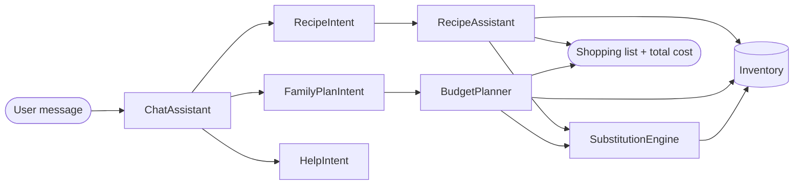
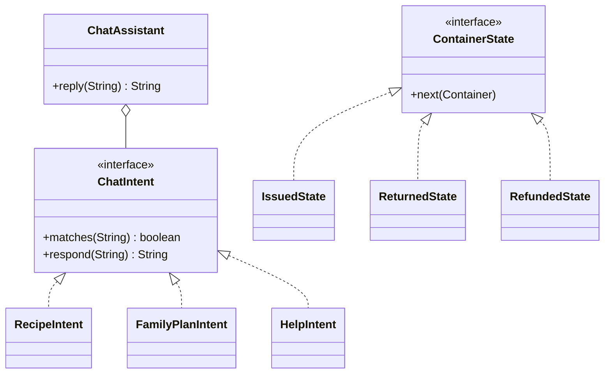

# Smart-Store
OOP lab project: a smart super-shop application built with Java
<svg xmlns="http://www.w3.org/2000/svg" viewBox="0 0 1280 400" width="1280" height="400" role="img" aria-label="Smart Store banner" xmlns:c2pa="http://c2pa.org/manifest"><metadata><c2pa:manifest>AAAWgmp1bWIAAAAeanVtZGMycGEAEQAQgAAAqgA4m3EDYzJwYQAAABZcanVtYgAAAEdqdW1kYzJtYQARABCAAACqADibcQN1cm46YzJwYTo3MjgzODBhMy02YTdmLTQ5ZmQtODE1MC1mOWVkODdhMWY0NjcAAAADl2p1bWIAAAApanVtZGMyYXMAEQAQgAAAqgA4m3EDYzJwYS5hc3NlcnRpb25zAAAAALxqdW1iAAAARGp1bWRjYm9yABEAEIAAAKoAOJtxE2MycGEuaW5ncmVkaWVudC52MwAAAAAYYzJzaEpCRAtyozZ+yqlfaBWKj6UAAABwY2JvcqNpZGM6Zm9ybWF0bWltYWdlL3N2Zyt4bWxqaW5zdGFuY2VJRHgseG1wOmlpZDo1ZTlmZDA4ZS1jZjIxLTQ2NDUtYTg4MS1jNjZhMWRhMDU0ZGVscmVsYXRpb25zaGlwaHBhcmVudE9mAAAB4mp1bWIAAABBanVtZGNib3IAEQAQgAAAqgA4m3ETYzJwYS5hY3Rpb25zLnYyAAAAABhjMnNoBJv8MKmj4SxaI4crGSiaqQAAAZljYm9yomdhY3Rpb25zgqJmYWN0aW9ua2MycGEub3BlbmVkanBhcmFtZXRlcnOha2luZ3JlZGllbnRzgaJjdXJseC1zZWxmI2p1bWJmPWMycGEuYXNzZXJ0aW9ucy9jMnBhLmluZ3JlZGllbnQudjNkaGFzaFggfLigwSmjrY+1KE5x7nU1o03MXz+Ov4KCjKaVj72QTtWkZmFjdGlvbngdY29tLmFudGhyb3BpYy5jbGF1ZGUucHJvdmlkZWRqcGFyYW1ldGVyc6F4H2NvbS5hbnRocm9waWMub3JpZ2luLWNvbmZpZGVuY2VndW5rbm93bmtkZXNjcmlwdGlvbnhmQ2xhdWRlIHByb3ZpZGVkIHRoaXMgZmlsZSBhdCB0aGUgcmVxdWVzdCBvZiBhIHVzZXIgYW5kIG1heSBoYXZlIGNyZWF0ZWQgb3IgbW9kaWZpZWQgdGhlIGZpbGUgY29udGVudHMubXNvZnR3YXJlQWdlbnShZG5hbWVmQ2xhdWRlcmFsbEFjdGlvbnNJbmNsdWRlZPUAAADIanVtYgAAAEBqdW1kY2JvcgARABCAAACqADibcRNjMnBhLmhhc2guZGF0YQAAAAAYYzJzaGzZqZdK3Oaa2kfS8mzm6x0AAACAY2JvcqVjYWxnZnNoYTI1NmNwYWRNAAAAAAAAAAAAAAAAAGRoYXNoWCBk1GltC1EGQ8rLC8iXAPxGB71qVMxhJu5dtPsueDKeU2RuYW1lbmp1bWJmIG1hbmlmZXN0amV4Y2x1c2lvbnOBomVzdGFydBjDZmxlbmd0aBkeBAAAAj5qdW1iAAAAJ2p1bWRjMmNsABEAEIAAAKoAOJtxA2MycGEuY2xhaW0udjIAAAACD2Nib3KlY2FsZ2ZzaGEyNTZpc2lnbmF0dXJleE1zZWxmI2p1bWJmPS9jMnBhL3VybjpjMnBhOjcyODM4MGEzLTZhN2YtNDlmZC04MTUwLWY5ZWQ4N2ExZjQ2Ny9jMnBhLnNpZ25hdHVyZWppbnN0YW5jZUlEeCx4bXA6aWlkOjI5ODhkYjNkLTIwZTktNDcwZS05MzYzLTA4N2E5MDIxMTMzNnJjcmVhdGVkX2Fzc2VydGlvbnODomN1cmx4LXNlbGYjanVtYmY9YzJwYS5hc3NlcnRpb25zL2MycGEuaW5ncmVkaWVudC52M2RoYXNoWCB8uKDBKaOtj7UoTnHudTWjTcxfP46/goKMppWPvZBO1aJjdXJseCpzZWxmI2p1bWJmPWMycGEuYXNzZXJ0aW9ucy9jMnBhLmFjdGlvbnMudjJkaGFzaFggjAY4C7OpQuMXy2tdf9CtbjQj4x/auaQhWjx/KA1BNjaiY3VybHgpc2VsZiNqdW1iZj1jMnBhLmFzc2VydGlvbnMvYzJwYS5oYXNoLmRhdGFkaGFzaFggWvXiKlYssS2kqLvqX7biuQdhAwfdpFHsjy1zsXGIUaZ0Y2xhaW1fZ2VuZXJhdG9yX2luZm+jZG5hbWVvQW50aHJvcGljIEZpbGVzZ3ZlcnNpb25lMS4wLjBrc3BlY1ZlcnNpb25lMi40LjAAABA4anVtYgAAAChqdW1kYzJjcwARABCAAACqADibcQNjMnBhLnNpZ25hdHVyZQAAABAIY2JvctKEWQISogEmGCFZAgowggIGMIIBjaADAgECAhRA5aAK7sI50L64g/oGQgU9Z1UTADAKBggqhkjOPQQDAzBJMRcwFQYDVQQKEw5BbnRocm9waWMsIFBCQzEuMCwGA1UEAxMlQW50aHJvcGljIENvbnRlbnQgQ3JlZGVudGlhbHMgUm9vdCBDQTAeFw0yNjA4MDcxODQzNTZaFw0yODA4MDYxOTQzNTZaMEQxFzAVBgNVBAoTDkFudGhyb3BpYywgUEJDMSkwJwYDVQQDEyBBbnRocm9waWMgQ2xhdWRlIENvbnRlbnQgU2lnbmluZzBZMBMGByqGSM49AgEGCCqGSM49AwEHA0IABJh6CmvLUBgFFNU0vUKlOVtE6djd17L5SuwX0LemFisBM3dkd/3cyjxFA3Qo5S46fX0/ihY0VZ7mfb9KF703t5OjWDBWMA4GA1UdDwEB/wQEAwIHgDAVBgNVHSUEDjAMBgorBgEEAYPoXgIBMAwGA1UdEwEB/wQCMAAwHwYDVR0jBBgwFoAUzlHiBIFOZFsj+OPEz5o+nMHXXMIwCgYIKoZIzj0EAwMDZwAwZAIwMXMdFJ4BetLLVY7ORuE9noqbbAZOZn/aArXyTwFAZfKrPzxF2vPoJNf1+UCdg1XGAjBwX1zd9WGqYkqmL5SFqw1QySjr1zJfpJM9+1rdDwSPLMOPOjKuiXjoU/pUUeG9RwmhY3BhZFkNngAAAAAAAAAAAAAAAAAAAAAAAAAAAAAAAAAAAAAAAAAAAAAAAAAAAAAAAAAAAAAAAAAAAAAAAAAAAAAAAAAAAAAAAAAAAAAAAAAAAAAAAAAAAAAAAAAAAAAAAAAAAAAAAAAAAAAAAAAAAAAAAAAAAAAAAAAAAAAAAAAAAAAAAAAAAAAAAAAAAAAAAAAAAAAAAAAAAAAAAAAAAAAAAAAAAAAAAAAAAAAAAAAAAAAAAAAAAAAAAAAAAAAAAAAAAAAAAAAAAAAAAAAAAAAAAAAAAAAAAAAAAAAAAAAAAAAAAAAAAAAAAAAAAAAAAAAAAAAAAAAAAAAAAAAAAAAAAAAAAAAAAAAAAAAAAAAAAAAAAAAAAAAAAAAAAAAAAAAAAAAAAAAAAAAAAAAAAAAAAAAAAAAAAAAAAAAAAAAAAAAAAAAAAAAAAAAAAAAAAAAAAAAAAAAAAAAAAAAAAAAAAAAAAAAAAAAAAAAAAAAAAAAAAAAAAAAAAAAAAAAAAAAAAAAAAAAAAAAAAAAAAAAAAAAAAAAAAAAAAAAAAAAAAAAAAAAAAAAAAAAAAAAAAAAAAAAAAAAAAAAAAAAAAAAAAAAAAAAAAAAAAAAAAAAAAAAAAAAAAAAAAAAAAAAAAAAAAAAAAAAAAAAAAAAAAAAAAAAAAAAAAAAAAAAAAAAAAAAAAAAAAAAAAAAAAAAAAAAAAAAAAAAAAAAAAAAAAAAAAAAAAAAAAAAAAAAAAAAAAAAAAAAAAAAAAAAAAAAAAAAAAAAAAAAAAAAAAAAAAAAAAAAAAAAAAAAAAAAAAAAAAAAAAAAAAAAAAAAAAAAAAAAAAAAAAAAAAAAAAAAAAAAAAAAAAAAAAAAAAAAAAAAAAAAAAAAAAAAAAAAAAAAAAAAAAAAAAAAAAAAAAAAAAAAAAAAAAAAAAAAAAAAAAAAAAAAAAAAAAAAAAAAAAAAAAAAAAAAAAAAAAAAAAAAAAAAAAAAAAAAAAAAAAAAAAAAAAAAAAAAAAAAAAAAAAAAAAAAAAAAAAAAAAAAAAAAAAAAAAAAAAAAAAAAAAAAAAAAAAAAAAAAAAAAAAAAAAAAAAAAAAAAAAAAAAAAAAAAAAAAAAAAAAAAAAAAAAAAAAAAAAAAAAAAAAAAAAAAAAAAAAAAAAAAAAAAAAAAAAAAAAAAAAAAAAAAAAAAAAAAAAAAAAAAAAAAAAAAAAAAAAAAAAAAAAAAAAAAAAAAAAAAAAAAAAAAAAAAAAAAAAAAAAAAAAAAAAAAAAAAAAAAAAAAAAAAAAAAAAAAAAAAAAAAAAAAAAAAAAAAAAAAAAAAAAAAAAAAAAAAAAAAAAAAAAAAAAAAAAAAAAAAAAAAAAAAAAAAAAAAAAAAAAAAAAAAAAAAAAAAAAAAAAAAAAAAAAAAAAAAAAAAAAAAAAAAAAAAAAAAAAAAAAAAAAAAAAAAAAAAAAAAAAAAAAAAAAAAAAAAAAAAAAAAAAAAAAAAAAAAAAAAAAAAAAAAAAAAAAAAAAAAAAAAAAAAAAAAAAAAAAAAAAAAAAAAAAAAAAAAAAAAAAAAAAAAAAAAAAAAAAAAAAAAAAAAAAAAAAAAAAAAAAAAAAAAAAAAAAAAAAAAAAAAAAAAAAAAAAAAAAAAAAAAAAAAAAAAAAAAAAAAAAAAAAAAAAAAAAAAAAAAAAAAAAAAAAAAAAAAAAAAAAAAAAAAAAAAAAAAAAAAAAAAAAAAAAAAAAAAAAAAAAAAAAAAAAAAAAAAAAAAAAAAAAAAAAAAAAAAAAAAAAAAAAAAAAAAAAAAAAAAAAAAAAAAAAAAAAAAAAAAAAAAAAAAAAAAAAAAAAAAAAAAAAAAAAAAAAAAAAAAAAAAAAAAAAAAAAAAAAAAAAAAAAAAAAAAAAAAAAAAAAAAAAAAAAAAAAAAAAAAAAAAAAAAAAAAAAAAAAAAAAAAAAAAAAAAAAAAAAAAAAAAAAAAAAAAAAAAAAAAAAAAAAAAAAAAAAAAAAAAAAAAAAAAAAAAAAAAAAAAAAAAAAAAAAAAAAAAAAAAAAAAAAAAAAAAAAAAAAAAAAAAAAAAAAAAAAAAAAAAAAAAAAAAAAAAAAAAAAAAAAAAAAAAAAAAAAAAAAAAAAAAAAAAAAAAAAAAAAAAAAAAAAAAAAAAAAAAAAAAAAAAAAAAAAAAAAAAAAAAAAAAAAAAAAAAAAAAAAAAAAAAAAAAAAAAAAAAAAAAAAAAAAAAAAAAAAAAAAAAAAAAAAAAAAAAAAAAAAAAAAAAAAAAAAAAAAAAAAAAAAAAAAAAAAAAAAAAAAAAAAAAAAAAAAAAAAAAAAAAAAAAAAAAAAAAAAAAAAAAAAAAAAAAAAAAAAAAAAAAAAAAAAAAAAAAAAAAAAAAAAAAAAAAAAAAAAAAAAAAAAAAAAAAAAAAAAAAAAAAAAAAAAAAAAAAAAAAAAAAAAAAAAAAAAAAAAAAAAAAAAAAAAAAAAAAAAAAAAAAAAAAAAAAAAAAAAAAAAAAAAAAAAAAAAAAAAAAAAAAAAAAAAAAAAAAAAAAAAAAAAAAAAAAAAAAAAAAAAAAAAAAAAAAAAAAAAAAAAAAAAAAAAAAAAAAAAAAAAAAAAAAAAAAAAAAAAAAAAAAAAAAAAAAAAAAAAAAAAAAAAAAAAAAAAAAAAAAAAAAAAAAAAAAAAAAAAAAAAAAAAAAAAAAAAAAAAAAAAAAAAAAAAAAAAAAAAAAAAAAAAAAAAAAAAAAAAAAAAAAAAAAAAAAAAAAAAAAAAAAAAAAAAAAAAAAAAAAAAAAAAAAAAAAAAAAAAAAAAAAAAAAAAAAAAAAAAAAAAAAAAAAAAAAAAAAAAAAAAAAAAAAAAAAAAAAAAAAAAAAAAAAAAAAAAAAAAAAAAAAAAAAAAAAAAAAAAAAAAAAAAAAAAAAAAAAAAAAAAAAAAAAAAAAAAAAAAAAAAAAAAAAAAAAAAAAAAAAAAAAAAAAAAAAAAAAAAAAAAAAAAAAAAAAAAAAAAAAAAAAAAAAAAAAAAAAAAAAAAAAAAAAAAAAAAAAAAAAAAAAAAAAAAAAAAAAAAAAAAAAAAAAAAAAAAAAAAAAAAAAAAAAAAAAAAAAAAAAAAAAAAAAAAAAAAAAAAAAAAAAAAAAAAAAAAAAAAAAAAAAAAAAAAAAAAAAAAAAAAAAAAAAAAAAAAAAAAAAAAAAAAAAAAAAAAAAAAAAAAAAAAAAAAAAAAAAAAAAAAAAAAAAAAAAAAAAAAAAAAAAAAAAAAAAAAAAAAAAAAAAAAAAAAAAAAAAAAAAAAAAAAAAAAAAAAAAAAAAAAAAAAAAAAAAAAAAAAAAAAAAAAAAAAAAAAAAAAAAAAAAAAAAAAAAAAAAAAAAAAAAAAAAAAAAAAAAAAAAAAAAAAAAAAAAAAAAAAAAAAAAAAAAAAAAAAAAAAAAAAAAAAAAAAAAAAAAAAAAAAAAAAAAAAAAAAAAAAAAAAAAAAAAAAAAAAAAAAAAAAAAAAAAAAAAAAAAAAAAAAAAAAAAAAAAAAAAAAAAAAAAAAAAAAAAAAAAAAAAAAAAAAAAAAAAAAAAAAAAAAAAAAAAAAAAAAAAAAAAAAAAAAAAAAAAAAAAAAAAAAAAAAAAAAAAAAAAAAAAAAAAAAAAAAAAAAAAAAAAAAAAAAAAAAAAAAAAAAAAAAAAAAAAAAAAAAAAAAAAAAAAAAAAAAAAAAAAAAAAAAAAAAAAAAAAAAAAAAAAAAAAAAAAAAAAAAAAAAAAAAAAAAAAAAAAAAAAAAAAAAAAAAAAAAAAAAAAAAAAAAAAAAAAAAAAAAAAAAAAAAAAAAAAAAAAAAAAAAAAAAAAAAAAAAAAAAAAAAAAAAAAAAAAAAAAAAAAAAAAAAAAAAAAAAAAAAAAAAAAAAAAAAAAAAAAAAAAAAAAAAAAAAAAAAAAAAAAAAAAAAAAAAAAAAAAAAAAAAAAAAAAAAAAAAAAAAAAAAAAAAAAAAAAAAAAAAAAAAAAAAAAAAAAAAAAAAAAAAAAAAAAAAAAAAAAAAAAAAAAAAAAAAAAAAAAAAAAAAAAAAAAAAAAAAAAAAAAAAAAAAAAAAAAAAAAAAAAAAAAAAAAAAAAAAAAAAAAAAAAAAAAAAAAAAAAAAAAAAAAAAAAAAAAAAAAAAAAAAAAAAAAAAAAAAAAAAAAAAAAAAAAAAAAAAAAAAAAAAAAAAAAAAAAAAAAAAAAAAAAAAAAAAAAAAAAAAAAAAAAAAAAAAAAAAAAAAAAAAAAAAAAAAAAAAAAAAAAAAAAAAAAAAAAAAAAAAAAAAAAAAAAAAAAAAAAAAAAAAAAAAAAAAAAAAAAAAAAAAAAAAAAAAAAAAAAAAAAAAAAAAAAAAAAAAAAAAAAAAAAAAAAAAAAAAAAAAAAAAAAAAAAAAAAAAAAAAAAAAAAAAAAAAAAAAAAAAAAAAAAAAAAAAAAAAAAAAAAAAAAAAAAAAAAAAAAAAAAAAAAAAAAAAAAAAAAAAAAAAAAAAAAAAAAAAAAAAAAAAAAAAAAAAAAAAAAAAAAAAAAAAAAAAAAAAAAAAAAAAAAAAAAAAAAAAAAAAAAAAAAAAAAAAAAAAAAAAAAAAAAAAAAAAAAAAAAAAAAAAAAAAAAAAAAAAAAAAAAAAAAAAAAAAAAAAAAAAAAAAAAAAAAAAAAAAAAAAAAAAAAAAAAAAPZYQHNBH+DeL+s135DhV4p95UZn87mIfn+XP4fl75QmlcDms5XzBWXJXe9QTR2tqFveyfZkKLaKomvVmPNIraMOyVU=</c2pa:manifest></metadata>
  <title>Smart Store</title>
  <defs>
    <linearGradient id="bg" x1="0" y1="0" x2="1" y2="1">
      <stop offset="0" stop-color="#06140f"/>
      <stop offset="0.55" stop-color="#0b2e22"/>
      <stop offset="1" stop-color="#0a2233"/>
    </linearGradient>
    <radialGradient id="glow" cx="1000" cy="210" r="260" gradientUnits="userSpaceOnUse">
      <stop offset="0" stop-color="#34d399" stop-opacity="0.35"/>
      <stop offset="1" stop-color="#34d399" stop-opacity="0"/>
    </radialGradient>
    <radialGradient id="glow2" cx="120" cy="60" r="300" gradientUnits="userSpaceOnUse">
      <stop offset="0" stop-color="#38bdf8" stop-opacity="0.18"/>
      <stop offset="1" stop-color="#38bdf8" stop-opacity="0"/>
    </radialGradient>
    <filter id="blur" x="-50%" y="-50%" width="200%" height="200%"><feGaussianBlur stdDeviation="8"/></filter>
    <style>
      .t { font-family: 'Segoe UI', 'Helvetica Neue', Arial, sans-serif; font-weight: 800; font-size: 88px; }
      .s { font-family: 'Segoe UI', 'Helvetica Neue', Arial, sans-serif; font-size: 26px; fill: #a7f3d0; }
      .c { font-family: 'Segoe UI', 'Helvetica Neue', Arial, sans-serif; font-size: 18px; font-weight: 600; fill: #ecfdf5; }
      .m { font-family: 'Segoe UI', 'Helvetica Neue', Arial, sans-serif; font-size: 16px; fill: #6ee7b7; opacity: 0.85; }
    </style>
  </defs>
  <rect width="1280" height="400" rx="18" fill="url(#bg)"/>
  <rect width="1280" height="400" rx="18" fill="url(#glow2)"/>
  <rect width="1280" height="400" rx="18" fill="url(#glow)"/>
  <polygon points="1000.0,130.0 1225.2,260.0 1000.0,390.0 774.8,260.0" fill="rgba(110,231,183,0.06)" stroke="rgba(110,231,183,0.25)" stroke-width="1.2"/>
<line x1="1022.5" y1="143.0" x2="797.4" y2="273.0" stroke="rgba(110,231,183,0.12)"/>
<line x1="977.5" y1="143.0" x2="1202.6" y2="273.0" stroke="rgba(110,231,183,0.12)"/>
<line x1="1045.0" y1="156.0" x2="819.9" y2="286.0" stroke="rgba(110,231,183,0.12)"/>
<line x1="955.0" y1="156.0" x2="1180.1" y2="286.0" stroke="rgba(110,231,183,0.12)"/>
<line x1="1067.5" y1="169.0" x2="842.4" y2="299.0" stroke="rgba(110,231,183,0.12)"/>
<line x1="932.5" y1="169.0" x2="1157.6" y2="299.0" stroke="rgba(110,231,183,0.12)"/>
<line x1="1090.1" y1="182.0" x2="864.9" y2="312.0" stroke="rgba(110,231,183,0.12)"/>
<line x1="909.9" y1="182.0" x2="1135.1" y2="312.0" stroke="rgba(110,231,183,0.12)"/>
<line x1="1112.6" y1="195.0" x2="887.4" y2="325.0" stroke="rgba(110,231,183,0.12)"/>
<line x1="887.4" y1="195.0" x2="1112.6" y2="325.0" stroke="rgba(110,231,183,0.12)"/>
<line x1="1135.1" y1="208.0" x2="909.9" y2="338.0" stroke="rgba(110,231,183,0.12)"/>
<line x1="864.9" y1="208.0" x2="1090.1" y2="338.0" stroke="rgba(110,231,183,0.12)"/>
<line x1="1157.6" y1="221.0" x2="932.5" y2="351.0" stroke="rgba(110,231,183,0.12)"/>
<line x1="842.4" y1="221.0" x2="1067.5" y2="351.0" stroke="rgba(110,231,183,0.12)"/>
<line x1="1180.1" y1="234.0" x2="955.0" y2="364.0" stroke="rgba(110,231,183,0.12)"/>
<line x1="819.9" y1="234.0" x2="1045.0" y2="364.0" stroke="rgba(110,231,183,0.12)"/>
<line x1="1202.6" y1="247.0" x2="977.5" y2="377.0" stroke="rgba(110,231,183,0.12)"/>
<line x1="797.4" y1="247.0" x2="1022.5" y2="377.0" stroke="rgba(110,231,183,0.12)"/>
<ellipse cx="1000" cy="335" rx="150" ry="40" fill="#000" opacity="0.45" filter="url(#blur)"/>
<ellipse cx="850" cy="292" rx="40" ry="12" fill="#000" opacity="0.35" filter="url(#blur)"/>
<ellipse cx="1130" cy="292" rx="34" ry="10" fill="#000" opacity="0.35" filter="url(#blur)"/>
<polygon points="870.1,245.0 1000.0,320.0 1000.0,225.0 870.1,150.0" fill="#10b981" stroke="rgba(0,0,0,0.25)" stroke-width="1" stroke-linejoin="round"/>
<polygon points="1129.9,245.0 1000.0,320.0 1000.0,225.0 1129.9,150.0" fill="#047857" stroke="rgba(0,0,0,0.25)" stroke-width="1" stroke-linejoin="round"/>
<polygon points="1000.0,75.0 1129.9,150.0 1000.0,225.0 870.1,150.0" fill="#6ee7b7" stroke="rgba(0,0,0,0.25)" stroke-width="1" stroke-linejoin="round"/>
<polygon points="915.1,271.0 955.0,294.0 955.0,234.0 915.1,211.0" fill="#064e3b" stroke="#a7f3d0" stroke-width="1.5" opacity="1"/>
<polygon points="920.3,274.0 949.8,291.0 949.8,237.0 920.3,220.0" fill="#022c22" stroke="none" stroke-width="0" opacity="1"/>
<polygon points="896.1,192.0 974.0,237.0 974.0,219.0 896.1,174.0" fill="#fbbf24" stroke="#b45309" stroke-width="1" opacity="1"/>
<polygon points="1103.9,222.0 1026.0,267.0 1026.0,233.0 1103.9,188.0" fill="#022c22" stroke="#a7f3d0" stroke-width="1.5" opacity="1"/>
<polygon points="1098.7,219.0 1065.0,238.5 1065.0,216.5 1098.7,197.0" fill="#38bdf8" stroke="none" stroke-width="0" opacity="0.85"/>
<polygon points="1060.6,241.0 1031.2,258.0 1031.2,236.0 1060.6,219.0" fill="#7dd3fc" stroke="none" stroke-width="0" opacity="0.7"/>
<polygon points="847.6,150.0 1000.0,238.0 1000.0,222.0 847.6,134.0" fill="#34d399" stroke="rgba(0,0,0,0.25)" stroke-width="1" stroke-linejoin="round"/>
<polygon points="1152.4,150.0 1000.0,238.0 1000.0,222.0 1152.4,134.0" fill="#059669" stroke="rgba(0,0,0,0.25)" stroke-width="1" stroke-linejoin="round"/>
<polygon points="1000.0,46.0 1152.4,134.0 1000.0,222.0 847.6,134.0" fill="#a7f3d0" stroke="rgba(0,0,0,0.25)" stroke-width="1" stroke-linejoin="round"/>
<polygon points="811.9,272.0 850.0,294.0 850.0,250.0 811.9,228.0" fill="#f59e0b" stroke="rgba(0,0,0,0.25)" stroke-width="1" stroke-linejoin="round"/>
<polygon points="888.1,272.0 850.0,294.0 850.0,250.0 888.1,228.0" fill="#b45309" stroke="rgba(0,0,0,0.25)" stroke-width="1" stroke-linejoin="round"/>
<polygon points="850.0,206.0 888.1,228.0 850.0,250.0 811.9,228.0" fill="#fcd34d" stroke="rgba(0,0,0,0.25)" stroke-width="1" stroke-linejoin="round"/>
<polygon points="824.0,228.0 850.0,243.0 850.0,213.0 824.0,198.0" fill="#3b82f6" stroke="rgba(0,0,0,0.25)" stroke-width="1" stroke-linejoin="round"/>
<polygon points="876.0,228.0 850.0,243.0 850.0,213.0 876.0,198.0" fill="#1d4ed8" stroke="rgba(0,0,0,0.25)" stroke-width="1" stroke-linejoin="round"/>
<polygon points="850.0,183.0 876.0,198.0 850.0,213.0 824.0,198.0" fill="#93c5fd" stroke="rgba(0,0,0,0.25)" stroke-width="1" stroke-linejoin="round"/>
<polygon points="1098.8,280.0 1130.0,298.0 1130.0,262.0 1098.8,244.0" fill="#14b8a6" stroke="rgba(0,0,0,0.25)" stroke-width="1" stroke-linejoin="round"/>
<polygon points="1161.2,280.0 1130.0,298.0 1130.0,262.0 1161.2,244.0" fill="#0f766e" stroke="rgba(0,0,0,0.25)" stroke-width="1" stroke-linejoin="round"/>
<polygon points="1130.0,226.0 1161.2,244.0 1130.0,262.0 1098.8,244.0" fill="#5eead4" stroke="rgba(0,0,0,0.25)" stroke-width="1" stroke-linejoin="round"/>
<ellipse cx="770" cy="205" rx="14" ry="5" fill="#000" opacity="0.25" filter="url(#blur)"/>
<polygon points="754.4,109.0 770.0,118.0 770.0,100.0 754.4,91.0" fill="#fbbf24" stroke="rgba(0,0,0,0.25)" stroke-width="1" stroke-linejoin="round"/>
<polygon points="785.6,109.0 770.0,118.0 770.0,100.0 785.6,91.0" fill="#d97706" stroke="rgba(0,0,0,0.25)" stroke-width="1" stroke-linejoin="round"/>
<polygon points="770.0,82.0 785.6,91.0 770.0,100.0 754.4,91.0" fill="#fde68a" stroke="rgba(0,0,0,0.25)" stroke-width="1" stroke-linejoin="round"/>
<ellipse cx="1180" cy="215" rx="12" ry="4" fill="#000" opacity="0.22" filter="url(#blur)"/>
<polygon points="1167.0,93.5 1180.0,101.0 1180.0,86.0 1167.0,78.5" fill="#60a5fa" stroke="rgba(0,0,0,0.25)" stroke-width="1" stroke-linejoin="round"/>
<polygon points="1193.0,93.5 1180.0,101.0 1180.0,86.0 1193.0,78.5" fill="#2563eb" stroke="rgba(0,0,0,0.25)" stroke-width="1" stroke-linejoin="round"/>
<polygon points="1180.0,71.0 1193.0,78.5 1180.0,86.0 1167.0,78.5" fill="#bfdbfe" stroke="rgba(0,0,0,0.25)" stroke-width="1" stroke-linejoin="round"/>
  <text x="76.6" y="182.6" class="t" fill="rgb(6,60,45)">Smart Store</text>
<text x="75.7" y="181.7" class="t" fill="rgb(9,63,47)">Smart Store</text>
<text x="74.8" y="180.8" class="t" fill="rgb(12,66,49)">Smart Store</text>
<text x="73.9" y="179.9" class="t" fill="rgb(15,69,51)">Smart Store</text>
<text x="73.0" y="179.0" class="t" fill="rgb(18,72,53)">Smart Store</text>
<text x="72.1" y="178.1" class="t" fill="rgb(21,75,55)">Smart Store</text>
<text x="71.2" y="177.2" class="t" fill="rgb(24,78,57)">Smart Store</text>
<text x="70.3" y="176.3" class="t" fill="rgb(27,81,59)">Smart Store</text>
<text x="69.4" y="175.4" class="t" fill="rgb(30,84,61)">Smart Store</text>
<text x="68.5" y="174.5" class="t" fill="rgb(33,87,63)">Smart Store</text>
<text x="67.6" y="173.6" class="t" fill="rgb(36,90,65)">Smart Store</text>
<text x="66.7" y="172.7" class="t" fill="rgb(39,93,67)">Smart Store</text>
<text x="65.8" y="171.8" class="t" fill="rgb(42,96,69)">Smart Store</text>
<text x="64.9" y="170.9" class="t" fill="rgb(45,99,71)">Smart Store</text>
  <text x="64" y="170" class="t" fill="#ecfdf5">Smart Store</text>
  <text x="66" y="232" class="s">Recipe-based shopping assistant</text>
  <text x="66" y="266" class="s">and family monthly budget planner</text>
  <g>
    <rect x="66" y="298" width="112" height="38" rx="19" fill="rgba(255,255,255,0.08)" stroke="rgba(167,243,208,0.55)"/>
    <text x="122" y="323" class="c" text-anchor="middle">Java 17+</text>
    <rect x="192" y="298" width="96" height="38" rx="19" fill="rgba(255,255,255,0.08)" stroke="rgba(167,243,208,0.55)"/>
    <text x="240" y="323" class="c" text-anchor="middle">Swing</text>
    <rect x="302" y="298" width="168" height="38" rx="19" fill="rgba(255,255,255,0.08)" stroke="rgba(167,243,208,0.55)"/>
    <text x="386" y="323" class="c" text-anchor="middle">Rule-based AI</text>
  </g>
  <text x="66" y="372" class="m">OOP Lab Project  |  Daffodil International University</text>
</svg>
<div align="center">


<br/>


**Type a dish or a family size. Get a ready shopping list with prices.**

</div>

---

## 📑 Table of Contents

- [About the Project](#-about-the-project)
- [Objectives](#-objectives)
- [Key Features](#-key-features)
- [How the Mini AI Works](#-how-the-mini-ai-works)
- [Sample Chat](#-sample-chat)
- [OOP Concepts Used](#-oop-concepts-used)
- [Tech Stack](#-tech-stack)
- [Project Structure](#-project-structure)
- [Getting Started](#-getting-started)
- [Team](#-team)
- [Roadmap](#-roadmap)
- [Contributing](#-contributing)

---

## 📖 About the Project

**Smart Store** is a Java super-shop application that helps a customer shop faster and smarter. Instead of searching for items one by one, the customer writes a message like *"chicken roast 4 jon"* or *"poribar 5 jon, budget 15000"* and the app builds the shopping list, calculates the cost, and suggests substitutes when an item is out of stock.

The "AI" in this project is a **rule-based expert system**. It uses stored recipes, stock data, and clear rules to make decisions. It is not machine learning and it needs no internet connection.

This project is developed as a course project (Object-Oriented Programming Lab) at **Daffodil International University (DIU)**.

---

## 🎯 Objectives

> ✏️ **TODO:** Paste the objective bullet points you submitted in the project form here, so the README and your submission stay consistent.

-
-
-

---

## ✨ Key Features

| # | Feature | What it does | OOP idea | Status |
|---|---|---|---|---|
| 1 | 🍗 **Recipe-to-Grocery Bundler** | Dish name + number of people gives the full ingredient list, quantities and cost | Polymorphism, Abstraction | ✅ Core ready |
| 2 | 👨‍👩‍👧 **Family Monthly Budget Planner** | Family size + budget gives a monthly grocery list that fits the budget (greedy by priority) | Encapsulation | ✅ Core ready |
| 3 | 🔁 **Smart Substitution** | If an item is out of stock, suggests a similar item (same category, close price, in stock) | Interface, Open/Closed | ✅ Core ready |
| 4 | ⏳ **Dynamic Expiry Pricing** | Discounts increase as the expiry date gets closer (tier-based) | Interface, Polymorphism | 🚧 Planned |
| 5 | ♻️ **Eco Container Return & Cashback** | Container goes through states (issued, returned, refunded) and cashback goes to a wallet | State Pattern | 🚧 Planned |
| 6 | 🔒 **Cart Stock Lock (3 min)** | Reserves stock for a short time so two users cannot buy the last item | Multithreading | 🚧 Planned |

> Features are planned and may change as development continues.

---

## 🧠 How the Mini AI Works



1. The **ChatAssistant** sends the message to the first **ChatIntent** that matches it.
2. **RecipeAssistant** multiplies per-person quantities by the number of people and checks stock.
3. **BudgetPlanner** sorts items by priority and adds them one by one while the budget lasts (greedy method).
4. **SubstitutionEngine** finds an alternative when stock is low or the budget is tight.

To add a new chat feature, write one new class that implements `ChatIntent`. Existing code does not change (Open/Closed Principle).

---

## 💬 Sample Chat

```text
YOU: chicken roast 4 jon
BOT: chicken roast (4 jon):
- chicken: 1 kg = 210 Tk
- onion: 200 g = 12 Tk
- garlic: 40 g = 9 Tk
- yogurt: 120 g = 22 Tk
- soybean oil: 60 ml = 11 Tk
- salt: 12 g = <1 Tk
Mot khoroch: 264 Tk
```

```text
YOU: dawat e chicken roast 60 jon
BOT: chicken roast (60 jon):
- sonali chicken: 15 kg = 3600 Tk  (chicken stock e kom, tai sonali chicken)
...
```

> Prices and quantities are sample data and can be changed in the data files.

---

## 🧩 OOP Concepts Used

| Concept | Where |
|---|---|
| **Encapsulation** | `private` fields with getters/setters in `Product`, `Inventory` |
| **Inheritance** | `User` to `Admin` / `Customer`, `Product` to perishable / non-perishable |
| **Polymorphism** | `ChatIntent.respond()`, `PricingRule.apply()`, `Payment.pay()` |
| **Abstraction** | abstract classes and interfaces (`ChatIntent`, `PricingRule`, `ContainerState`) |
| **Design Patterns** | State Pattern (eco container), Strategy-style rules (pricing, substitution) |



---

## 🛠️ Tech Stack

| Layer | Technology |
|---|---|
| Language | Java 17+ |
| UI | Java Swing |
| Data storage | Text / CSV files |
| Concurrency | `java.util.concurrent` (scheduler, locks) |
| Diagrams | draw.io (UML), Mermaid |
| Version Control | Git & GitHub |

---

## 📁 Project Structure

```text
Smart-Store/
├── assets/            # banner and images
├── data/              # products, recipes, monthly items
├── docs/              # UML diagrams, report, screenshots
├── src/
│   └── smartstore/
│       ├── ai/        # recipe assistant, budget planner, chat
│       ├── pricing/   # dynamic expiry pricing rules
│       ├── eco/       # container return (State Pattern) and wallet
│       ├── lock/      # cart stock lock (multithreading)
│       └── ui/        # Swing screens
└── README.md
```

---

## 🚀 Getting Started

### Prerequisites

- Java JDK 17 or later
- Git

### Installation

```bash
# 1. Clone the repository
git clone https://github.com/jobayerhassan/Smart-Store.git

# 2. Move into the project folder
cd Smart-Store

# 3. Compile and run the console demo of the mini AI
javac -d out src/smartstore/ai/*.java
java -cp out smartstore.ai.Main
```

---

## 👥 Team

**Section:** ___ | **Institution:** Daffodil International University | **Course:** Object-Oriented Programming Lab

| Member | Student ID | Name | GitHub | Focus |
|---|---|---|---|---|
| Member 1 | 252-15-398 | Jobayer Hossen | [@jobayerhassan](https://github.com/jobayerhassan) | Recipe assistant and chat |
| Member 2 | 252-15-___ | _name_ | [@ishtiakinan8-creator](https://github.com/ishtiakinan8-creator) | Budget planner |
| Member 3 | 252-15-___ | _name_ | [@tafhim696](https://github.com/tafhim696) | Expiry pricing and substitution |
| Member 4 | 252-15-___ | _name_ | [@username](https://github.com/username) | Eco container return |
| Member 5 | 252-15-___ | _name_ | [@username](https://github.com/username) | Cart stock lock |

---

## 🗺️ Roadmap

- [x] Project proposal and team formation
- [x] GitHub repository setup
- [x] Core mini AI (recipe assistant, budget planner, substitution)
- [ ] Design data models and UML diagram
- [ ] Dynamic expiry pricing
- [ ] Eco container return with State Pattern
- [ ] Cart stock lock with multithreading
- [ ] Build Swing screens (login, shop, chat, cart, admin)
- [ ] Testing and bug fixing
- [ ] Report and final presentation

---

## 🤝 Contributing

1. Pull the latest code: `git pull`
2. Create a new branch for your work: `git checkout -b feature/your-feature`
3. Commit with a clear message: `git commit -m "Add ExpiryRule class"`
4. Push the branch: `git push origin feature/your-feature`
5. Open a Pull Request and ask a teammate to review it

Each member works in their own package so files do not clash. Shared files such as `Main.java` are edited by one person only.

---

## 📄 License

This project is created for academic purposes at Daffodil International University.

<div align="center">

Made with ☕ by the Smart Store team

</div>
