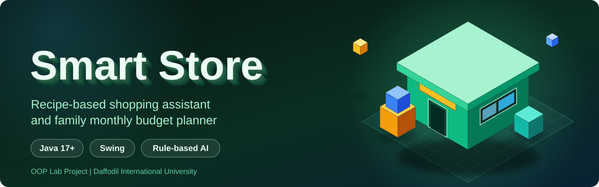
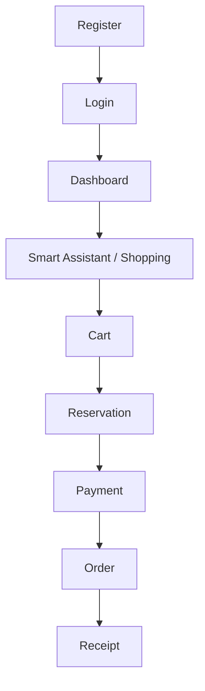
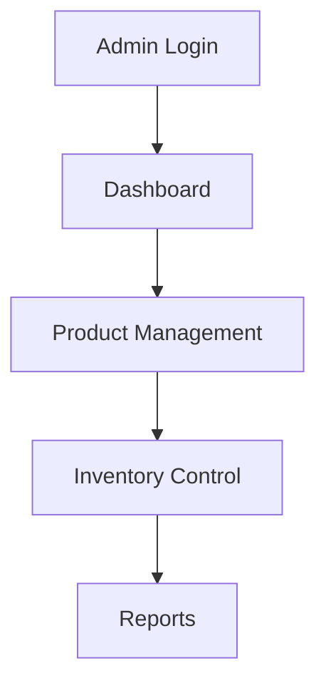
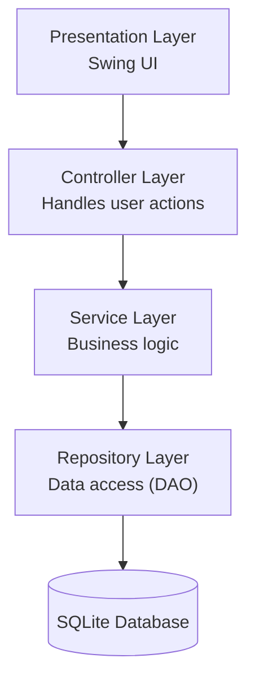
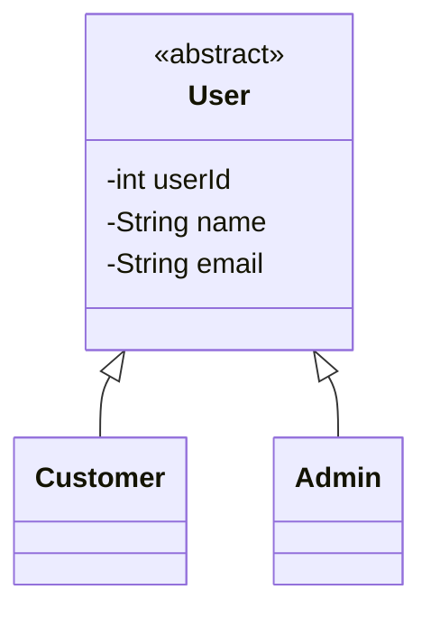
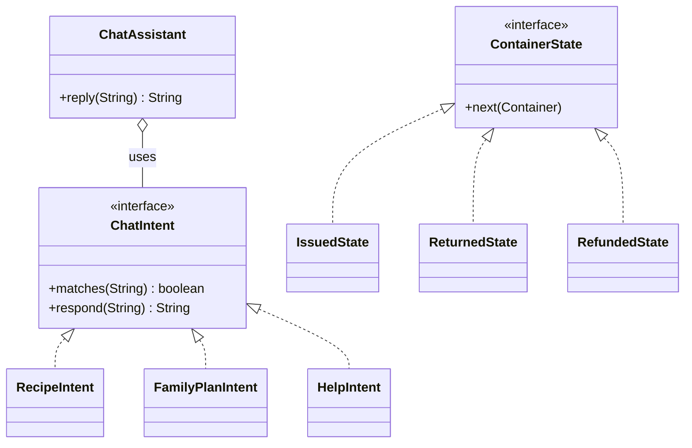

<p align="center">
  
</p>

<p align="center">
  
  
  
  
  
  
</p>

<p align="center"><b>Type a dish or a family size. Get a ready shopping list with prices.</b></p>

---

## Table of Contents

- [About the Project](#about-the-project)
- [Problem Statement](#problem-statement)
- [Objectives](#objectives)
- [Functional Requirements](#functional-requirements)
- [Non-Functional Requirements](#non-functional-requirements)
- [System Modules](#system-modules)
- [Key Features](#key-features)
- [Feature Implementation Details](#feature-implementation-details)
- [How the Smart Assistant Works](#how-the-smart-assistant-works)
- [Sample Chat](#sample-chat)
- [System Workflow](#system-workflow)
- [System Architecture](#system-architecture)
- [OOP Implementation](#oop-implementation)
- [Design Patterns](#design-patterns)
- [Database Design](#database-design)
- [Exception Handling](#exception-handling)
- [Testing Strategy](#testing-strategy)
- [Tech Stack](#tech-stack)
- [Project Structure](#project-structure)
- [Development Roadmap](#development-roadmap)
- [Team](#team)
- [Future Improvements](#future-improvements)
- [Contributing](#contributing)

---

## About the Project

**Smart Store** is a Java-based intelligent grocery retail management system, developed as a university Object-Oriented Programming lab project. It is inspired by modern superstore applications but is an independent academic implementation.

Instead of searching for items one by one, a customer can simply describe what they want — a dish, a family size, or a monthly budget — and Smart Store works out the ingredients, quantities, and cost automatically.

Smart Store combines traditional shopping operations with intelligent features:

- Smart shopping assistant
- Recipe-based grocery planning
- Family budget management
- Smart pantry
- Inventory intelligence
- Product substitution
- Expiry-based pricing
- Stock reservation
- Eco-friendly shopping

The goal is to demonstrate practical Java OOP concepts through a realistic retail system.

---

## Problem Statement

Traditional grocery systems mainly provide product browsing and purchasing. Common problems:

- Customers cannot efficiently plan groceries.
- Budget management is difficult.
- Recipe ingredients are forgotten.
- Products become unavailable.
- Expired products create waste.
- Inventory management becomes complex.

Smart Store provides intelligent solutions for both customers and store administrators.

---

## Objectives

| Objective | Solution |
|---|---|
| Smart grocery planning | Recipe Planner |
| Budget control | Family Budget Planner |
| Reduce waste | Expiry Pricing |
| Better recommendation | Substitute Engine |
| Inventory control | Batch Inventory |
| Prevent overselling | Reservation System |
| Sustainability | Eco Container |

---

## Functional Requirements

### FR-01 — User Authentication

The system shall allow users to register and log in.

**Classes:** `User`, `Customer`, `Admin`, `AuthService`

### FR-02 — Product Management

The Admin can:
- Add products
- Update products
- Remove products
- Manage categories

**Classes:** `Product`, `Category`, `ProductService`

### FR-03 — Smart Assistant

The system shall provide shopping assistance.

**Input:**
```
Chicken roast for 5 people
```

**Output:**
```
Ingredient list
Required quantity
Estimated cost
```

**Classes:** `ChatAssistant`, `ChatIntent`, `RecipeIntent`

---

## Non-Functional Requirements

| Requirement | Description |
|---|---|
| **Performance** | The system should respond quickly during normal operations. |
| **Maintainability** | The code should follow a modular architecture. |
| **Security** | User data should be protected. |
| **Reliability** | Database operations should maintain consistency. |

---

## System Modules

| Module | Responsible for |
|---|---|
| **1. Authentication** | User registration, login, role management |
| **2. Smart Assistant** | Recipe processing, user query handling, recommendation |
| **3. Planning System** | Budget planning, pantry management |
| **4. Inventory System** | Products, stock, expiry, pricing |
| **5. Transaction System** | Cart, order, payment |

---

## Key Features

| # | Feature | What it does | OOP idea | Status |
|---|---|---|---|---|
| 1 | Recipe-to-Grocery Bundler | Dish name + number of people → full ingredient list, quantities and cost | Polymorphism, Abstraction | ✅ Core ready |
| 2 | Family Monthly Budget Planner | Family size + budget → a monthly grocery list that fits the budget (greedy by priority) | Encapsulation | ✅ Core ready |
| 3 | Smart Substitution | If an item is out of stock, suggests a similar one (same category, close price, in stock) | Interface, Open/Closed | ✅ Core ready |
| 4 | Dynamic Expiry Pricing | Discounts increase as the expiry date gets closer (tier-based) | Interface, Polymorphism | 🚧 Planned |
| 5 | Eco Container Return & Cashback | Container moves through states (issued, returned, refunded); cashback goes to a wallet | State Pattern | 🚧 Planned |
| 6 | Cart Stock Lock (3 min) | Reserves stock briefly so two users can't buy the last item at once | Multithreading | 🚧 Planned |

> Features marked "Planned" may change as development continues.

---

## Feature Implementation Details

### Smart Recipe Planner

**Purpose:** Convert recipes into shopping requirements.

**Workflow:**
```
Recipe Input
    │
    ▼
Ingredient Calculation
    │
    ▼
Inventory Check
    │
    ▼
Missing Items
    │
    ▼
Cart
```

**Classes:** `Recipe`, `RecipeIngredient`, `RecipeService`, `ShoppingList`

**Database tables:** `recipes`, `recipe_items`, `products`

---

### Smart Pantry

**Purpose:** Track the customer's available household items.

**Example:**
```
Required Rice: 2kg

Available:
Rice 5kg

Purchase:
0kg
```

**Classes:** `Pantry`, `PantryItem`, `PantryService`

---

### Family Budget Planner

**Purpose:** Create optimized grocery plans.

**Inputs:** Family size, Budget, Priority items

**Classes:** `FamilyProfile`, `BudgetPlanner`, `BudgetPlan`, `Optimizer`

---

### Inventory Management

**Features:** Product stock, Batch tracking, Expiry tracking

**Classes:** `Product`, `InventoryBatch`, `InventoryService`

---

### FEFO Algorithm (First Expired, First Out)

**Logic:**
```
Sort inventory batches by expiry date
Select earliest expiry batch
Reduce quantity
Continue until requirement completed
```

---

### Smart Substitution Engine

**Purpose:** Recommend alternatives.

**Factors:** Category, Brand, Price, Size, Availability

**Classes:** `SubstitutionStrategy`, `SubstitutionService`

---

### Dynamic Pricing

**Purpose:** Generate expiry-based discounts.

**Example:**
```
Normal:      100%
Near Expiry: Discount
Expired:     Unavailable
```

**Classes:** `PricingRule`, `ExpiryPricingRule`, `PricingService`

---

### Cart and Order

**Workflow:**
```
Cart
  │
  ▼
Reservation
  │
  ▼
Payment
  │
  ▼
Order
  │
  ▼
Receipt
```

**Classes:** `Cart`, `Order`, `Payment`, `Receipt`

---

### Stock Reservation

**Purpose:** Prevent selling unavailable stock.

**Classes:** `Reservation`, `ReservationService`

---

### Eco Container System

Uses state management.

**States:** `Available → Issued → Returned → Refunded`

---

### Smart Rescue Basket

**Purpose:** Creates discounted bundles from near-expiry products.

**Example:**
```
Milk + Bread + Egg  =  Breakfast Rescue Pack
```

---

## How the Smart Assistant Works

The Smart Assistant reads a short, free-text request and turns it into a ready-to-buy shopping list.

```
Recipe / Family-size Input
        │
        ▼
Ingredient Calculation
        │
        ▼
Inventory Check
        │
        ▼
Missing Items Identified
        │
        ▼
Shopping List / Cart
```

**Classes involved:** `ChatAssistant`, `ChatIntent`, `RecipeIntent`, `FamilyPlanIntent`, `HelpIntent`, `RecipeService`, `ShoppingList`

---

## Sample Chat

```
You:      Chicken roast for 5 people

Assistant:
  Ingredients required:
    - Chicken            1.5 kg
    - Onion               0.4 kg
    - Garlic & Ginger      0.1 kg
    - Cooking Oil          0.3 L
    - Spices (mixed)       0.15 kg

  Estimated cost:  ৳ 850

  ✅ All items are currently in stock.
  Add to cart? (yes/no)
```

---

## System Workflow

**Customer workflow:**



**Admin workflow:**



---

## System Architecture

Smart Store follows a classic layered architecture, which keeps the UI, business rules, and data access cleanly separated.



| Layer | Responsibility |
|---|---|
| Presentation | Swing screens, user input/output |
| Controller | Receives UI events, delegates to services |
| Service | Core business rules (pricing, recipes, budget, substitution) |
| Repository | CRUD operations via JDBC, isolates SQL from business logic |
| Database | Persistent storage (SQLite) |

---

## OOP Implementation

| Pillar | Used in | Notes |
|---|---|---|
| **Encapsulation** | `Product`, `User`, `Order` | Private fields with getters and setters |
| **Inheritance** | `User` → `Customer`, `Admin` | Shared authentication fields, specialized behavior |
| **Polymorphism** | `Payment`, `PricingRule`, `SubstitutionStrategy` | Same call, different implementation per strategy |
| **Abstraction** | `ChatIntent`, `PricingRule`, `ContainerState`, `Repository` | Abstract classes & interfaces define the contract |

**User hierarchy:**



**Chat Assistant & Eco Container — class relationships:**



---

## Design Patterns

| Pattern | Used for |
|---|---|
| **Strategy** | Payment methods, pricing rules, substitution logic |
| **State** | Eco container lifecycle (Issued → Returned → Refunded) |
| **Repository** | Isolating database access from business logic |

---

## Database Design

**Technology:** SQLite + JDBC

| Table | Purpose |
|---|---|
| `users` | User data |
| `products` | Product data |
| `categories` | Categories |
| `inventory_batches` | Stock and expiry |
| `recipes` | Recipe data |
| `pantry_items` | Customer pantry |
| `carts` | Shopping cart |
| `orders` | Orders |
| `payments` | Payments |
| `reservations` | Stock reservation |
| `wallets` | Wallet data |

---

## Exception Handling

Custom exceptions used across the system:

- `UserNotFoundException`
- `ProductNotFoundException`
- `InsufficientStockException`
- `PaymentFailedException`

---

## Testing Strategy

Manually and unit-tested areas include:

- Authentication
- Recipe calculation
- Budget optimization
- Inventory
- Pricing
- Reservation
- Payment
- Order

---

## Tech Stack

| Component | Technology |
|---|---|
| Language | Java 17+ |
| UI | Swing |
| Database | SQLite + JDBC |
| Assistant logic | Rule-based intent matching |
| Build | (add your build tool — Maven/Gradle) |

---

## Project Structure

```
Smart-Store
└── src
    ├── model
    ├── service
    ├── repository
    ├── database
    ├── assistant
    ├── inventory
    ├── planner
    ├── cart
    ├── order
    ├── payment
    ├── eco
    └── ui
```

---

## Development Roadmap

**Phase 1**
- [x] Models
- [x] Database
- [x] Authentication

**Phase 2**
- [x] Product
- [x] Inventory
- [x] Recipe
- [x] Budget

**Phase 3**
- [ ] Pricing
- [ ] Reservation
- [ ] Eco System

**Phase 4**
- [ ] Testing
- [ ] UI
- [ ] Documentation

---

## Team

| Member | Responsibility |
|---|---|
| Member 1 | Authentication + Smart Assistant |
| Member 2 | Budget + Pantry |
| Member 3 | Inventory + Pricing |
| Member 4 | Cart + Order + Payment |
| Member 5 | Eco System + Dashboard |

---

## Future Improvements

- Mobile application
- AI chatbot
- Online delivery
- Supplier management
- Analytics dashboard

---

## Contributing

This is an academic lab project, but suggestions and pull requests are welcome:

1. Fork the repository
2. Create a feature branch (`git checkout -b feature/your-feature`)
3. Commit your changes
4. Open a pull request

---

<p align="center">Built with Java ❤️ — OOP Lab Project, Daffodil International University</p>
